# Fixtura Account Sync Service - Human-Readable Data Flow Guide

This document provides a clear, human-friendly overview of how the Fixtura Account Sync service works, with visual diagrams to help understand the system architecture and data flow.

## What This Service Does

The Fixtura Account Sync service is like a digital assistant that keeps sports club and association data up-to-date. It automatically:

- Scrapes competition data from PlayHQ websites
- Processes team and game information
- Stores everything back into the Strapi database
- Handles errors and sends notifications when things go wrong

## High-Level System Overview

```mermaid
graph LR
    A[Strapi Database<br/>🏠 Where data lives] --> B[Redis Queue<br/>📋 Job waiting list]
    B --> C[Worker Process<br/>👷 Does the work]
    C --> D[PlayHQ Website<br/>🌐 Source of sports data]
    D --> E[Scraped Data<br/>📊 Raw information]
    E --> F[Processed Data<br/>✨ Cleaned & organized]
    F --> A

    style A fill:#e1f5fe
    style B fill:#fff3e0
    style C fill:#f3e5f5
    style D fill:#e8f5e8
    style E fill:#fff8e1
    style F fill:#f1f8e9
```

## The Main Process Flow

Here's how a typical account sync works:

```mermaid
flowchart TD
    Start([🚀 Start: Account needs syncing]) --> Check{What type of account?}

    Check -->|Club| ClubPath[🏢 Process Club Account]
    Check -->|Association| AssociationPath[🏛️ Process Association Account]

    ClubPath --> GetData[📥 Get account details from database]
    AssociationPath --> GetData

    GetData --> ScrapeComp[🔍 Scrape competitions from PlayHQ]
    ScrapeComp --> StoreComp[💾 Store competitions in database]

    StoreComp --> ScrapeTeams[🔍 Scrape team data from PlayHQ]
    ScrapeTeams --> StoreTeams[💾 Store teams in database]

    StoreTeams --> ScrapeGames[🔍 Scrape game data from PlayHQ]
    ScrapeGames --> StoreGames[💾 Store games in database]

    StoreGames --> UpdateStatus[✅ Mark account as synced]
    UpdateStatus --> End([🎉 Complete!])

    %% Error handling
    ScrapeComp -.->|Error| HandleError[❌ Handle error & notify]
    ScrapeTeams -.->|Error| HandleError
    ScrapeGames -.->|Error| HandleError
    HandleError --> LogError[📝 Log error details]
    LogError --> NotifySlack[📱 Send Slack notification]
    NotifySlack --> End

    style Start fill:#e8f5e8
    style End fill:#e8f5e8
    style HandleError fill:#ffebee
    style LogError fill:#fff3e0
    style NotifySlack fill:#e3f2fd
```

## Queue System - How Jobs Are Managed

The service uses Redis queues to manage work efficiently:

```mermaid
graph TD
    subgraph "Job Types"
        A[syncUserAccount<br/>🔄 Main sync jobs]
        B[onboardNewAccount<br/>🆕 New account setup]
        C[checkAssetGeneratorAccountStatus<br/>📊 Asset status check]
    end

    subgraph "Job Processing"
        D[Club Processor<br/>🏢 Handles club accounts]
        E[Association Processor<br/>🏛️ Handles association accounts]
        F[Onboard Processor<br/>🆕 Handles new accounts]
    end

    subgraph "Job Results"
        G[✅ Success<br/>Job completed]
        H[❌ Failed<br/>Job failed]
        I[🔄 Retry<br/>Try again later]
    end

    A --> D
    A --> E
    B --> F

    D --> G
    D --> H
    E --> G
    E --> H
    F --> G
    F --> H

    H --> I
    I --> A

    style A fill:#e3f2fd
    style B fill:#e8f5e8
    style C fill:#fff3e0
    style G fill:#e8f5e8
    style H fill:#ffebee
    style I fill:#fff3e0
```

## Data Processing Pipeline

Here's how raw data becomes useful information:

```mermaid
graph LR
    subgraph "Step 1: Collect"
        A1[📥 Get account info<br/>from database]
        A2[📋 Get team details<br/>from database]
        A3[🏆 Get competition info<br/>from database]
    end

    subgraph "Step 2: Scrape"
        B1[🔍 Scrape competitions<br/>from PlayHQ]
        B2[🔍 Scrape teams<br/>from PlayHQ]
        B3[🔍 Scrape games<br/>from PlayHQ]
    end

    subgraph "Step 3: Process"
        C1[🧹 Clean competition data<br/>Remove duplicates]
        C2[🧹 Clean team data<br/>Validate information]
        C3[🧹 Clean game data<br/>Format correctly]
    end

    subgraph "Step 4: Store"
        D1[💾 Save competitions<br/>to database]
        D2[💾 Save teams<br/>to database]
        D3[💾 Save games<br/>to database]
    end

    A1 --> A2 --> A3
    A3 --> B1
    A3 --> B2
    A3 --> B3

    B1 --> C1 --> D1
    B2 --> C2 --> D2
    B3 --> C3 --> D3

    style A1 fill:#e3f2fd
    style A2 fill:#e3f2fd
    style A3 fill:#e3f2fd
    style B1 fill:#e8f5e8
    style B2 fill:#e8f5e8
    style B3 fill:#e8f5e8
    style C1 fill:#fff3e0
    style C2 fill:#fff3e0
    style C3 fill:#fff3e0
    style D1 fill:#f3e5f5
    style D2 fill:#f3e5f5
    style D3 fill:#f3e5f5
```

## Error Handling - When Things Go Wrong

The system is designed to handle errors gracefully:

```mermaid
graph TD
    Error[❌ Something goes wrong] --> Check{What type of error?}

    Check -->|Network Error| Network[🌐 Can't reach PlayHQ]
    Check -->|Scraping Error| Scraping[🔍 Can't extract data]
    Check -->|Database Error| Database[💾 Can't save data]
    Check -->|Queue Error| Queue[📋 Job processing failed]

    Network --> Log[📝 Log error details]
    Scraping --> Log
    Database --> Log
    Queue --> Log

    Log --> Notify[📱 Send Slack notification]
    Notify --> Cleanup[🧹 Clean up resources]
    Cleanup --> Retry{Should we retry?}

    Retry -->|Yes| Wait[⏳ Wait 5 minutes]
    Wait --> RetryJob[🔄 Try job again]
    RetryJob --> Error

    Retry -->|No| GiveUp[🛑 Mark as failed]
    GiveUp --> UpdateStatus[📊 Update account status]
    UpdateStatus --> End([🏁 End process])

    style Error fill:#ffebee
    style Log fill:#fff3e0
    style Notify fill:#e3f2fd
    style Cleanup fill:#f3e5f5
    style RetryJob fill:#e8f5e8
    style GiveUp fill:#ffebee
    style End fill:#e8f5e8
```

## Key Components Explained

### 🏠 **Strapi Database**

- Stores all account information, teams, competitions, and game data
- Acts as the central hub for all data

### 📋 **Redis Queue**

- Manages job scheduling and processing
- Ensures jobs are processed in order
- Handles retries when jobs fail

### 👷 **Worker Process**

- The main engine that processes jobs
- Coordinates all the different components
- Manages memory and resources

### 🌐 **PlayHQ Website**

- External source of sports data
- Provides competition, team, and game information
- Accessed through web scraping

### 🔍 **Scraping Modules**

- **GetCompetitions**: Finds all competitions for an account
- **GetTeams**: Finds all teams in competitions
- **GetGameData**: Finds all games for teams

### 💾 **Assignment Modules**

- **AssignCompetitions**: Saves competition data to database
- **AssignTeams**: Saves team data to database
- **AssignGameData**: Saves game data to database

### 📝 **Logging & Monitoring**

- Tracks all activities and errors
- Sends notifications to Slack
- Monitors memory usage and performance

## How to Read These Diagrams

- **🟢 Green boxes**: Successful operations or data sources
- **🔵 Blue boxes**: External systems or databases
- **🟡 Yellow boxes**: Processing or transformation steps
- **🔴 Red boxes**: Errors or failure points
- **🟣 Purple boxes**: Storage or persistence operations

The arrows show the flow of data and control through the system. Solid arrows indicate normal flow, while dotted arrows show error handling paths.

## Real-World Example

Let's walk through what happens when a sports club needs to be synced:

### 🏢 **Club Account Sync Example**

1. **📋 Job Created**: Someone adds a new club account to the system
2. **⏰ Queue Processing**: The job gets added to the `syncUserAccount` queue
3. **🏢 Club Processing**: The system identifies this as a club account and routes it to the Club Processor
4. **📥 Data Collection**: The system fetches the club's details from the database
5. **🔍 Competition Scraping**: It visits the club's PlayHQ page and finds all competitions
6. **💾 Store Competitions**: The competitions are saved to the database
7. **🔍 Team Scraping**: For each competition, it finds all teams
8. **💾 Store Teams**: The teams are saved to the database
9. **🔍 Game Scraping**: For each team, it finds all games (this can take a while!)
10. **💾 Store Games**: The games are saved to the database
11. **✅ Complete**: The account is marked as successfully synced

### 🏛️ **Association Account Sync Example**

Associations work similarly but handle multiple clubs:

1. **📋 Job Created**: An association account needs syncing
2. **🏛️ Association Processing**: Routed to the Association Processor
3. **📥 Data Collection**: Fetches association details and all its clubs
4. **🔄 Multiple Clubs**: Processes each club within the association
5. **🔍 Competition Scraping**: Finds competitions for the entire association
6. **🔍 Team Scraping**: Finds all teams across all clubs
7. **🔍 Game Scraping**: Finds all games for all teams
8. **💾 Store Everything**: Saves all data to the database
9. **✅ Complete**: Association is fully synced

## Common Scenarios

### ✅ **Successful Sync**

- All data is scraped successfully
- Everything is stored in the database
- Account status is updated to "synced"
- Success notification is logged

### ⚠️ **Partial Failure**

- Some data is scraped successfully
- Some scraping fails (e.g., network issues)
- Successful data is still stored
- Failed parts are logged and may be retried
- Account status reflects partial success

### ❌ **Complete Failure**

- Scraping fails completely
- No data is stored
- Error is logged and Slack notification sent
- Account status is updated to show failure
- Job may be retried later

## Performance Considerations

### 🚀 **Speed Optimizations**

- **Batch Processing**: Games are processed in batches of 10 teams
- **Memory Management**: Browser instances are cleaned up after each job
- **Queue Processing**: Multiple jobs can be processed simultaneously
- **Resource Cleanup**: Memory usage is monitored and optimized

### 📊 **Monitoring**

- **Memory Tracking**: Peak memory usage is recorded for each job
- **Time Tracking**: How long each job takes is logged
- **Error Tracking**: All errors are logged with detailed information
- **Slack Notifications**: Critical errors are sent to Slack immediately

## Troubleshooting Guide

### 🔍 **Common Issues**

**Problem**: Job keeps failing

- **Check**: Network connection to PlayHQ
- **Check**: Redis queue status
- **Check**: Memory usage (may be too high)
- **Solution**: Restart the worker process

**Problem**: Data not being scraped

- **Check**: PlayHQ website structure (may have changed)
- **Check**: Browser/Puppeteer configuration
- **Check**: Account permissions
- **Solution**: Update scraping selectors

**Problem**: Jobs stuck in queue

- **Check**: Redis connection
- **Check**: Worker process status
- **Check**: Queue configuration
- **Solution**: Clear queue and restart

### 📝 **Logs to Check**

- `combined.log`: General application logs
- `error.log`: Error-specific logs
- Slack notifications: Real-time error alerts
- Memory usage logs: Performance monitoring

This guide should help anyone understand how the Fixtura Account Sync service works, from high-level concepts to specific troubleshooting steps.
